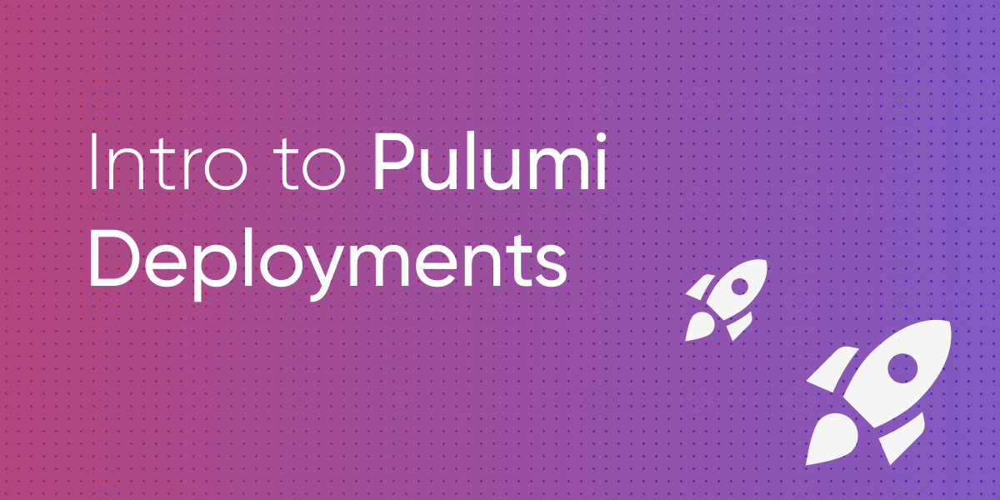

# Pulumi Deployments

## Introduction

Pulumi Deployments is a new product to power infrastructure and platform automation. It consists of five components:

1. __The Programmatic Deployment API__ - run Pulumi programs (`pulumi up`, `pulumi refresh`, etc) on Pulumi Service hardware (api.pulumi.com). This includes APIs to observe your deployment and all associated logs as it runs. 
2. __Click to Deploy__ - click a button from the Pulumi Service Console to run an ad hoc update on your stack.
3. __Deployment Visualization__ - rich UX to visualize deployment status, deployment logs, and queueing from via the Pulumi Service Console (app.pulumi.com).
4. __`git push` to Deploy__ -  Configure a stack to deploy automatically in response to `git push` events by installing the Pulumi GitHub App.
5. __Remote Automation API__ - Our strongly typed infrastructure orchestration technology can now run deployments remotely in the cloud.

A deployment in the Pulumi Service runs on an isolated, single use deployment runner (a virtual machine). That runner will prepare the runtime environment, clone source code, set up any necessary environment variables, run the Pulumi program, and handle reporting logs and status back to the Pulumi Service.

This API enables many of the same scenarios as Automation API, like platform building, self-service infrastructure, customer infrastructure workflows and portals, and more. The main difference is that Automation API programs run on your hardware, where you're responsible for handling asynchrony, workflow, reporting status, cancellations, etc. The Pulumi Deployment API takes care of workflow for you, providing API endpoints to monitor deployments, tail update logs, queue deployments, and cancel deployments.

**Watch the introduction video by clicking below**

## Docs

- [API Docs](https://www.pulumi.com/docs/reference/deployments-rest-api/)
- [Git Push To Deploy](https://www.pulumi.com/docs/intro/pulumi-service/deployments/#git-push-to-deploy-from-github)

## Examples

### Deployment Drivers

Deployment driver examples demonstrate how to use the Pulumi Deployment REST API to create deployments, monitor status, and tail logs.

- [typescript-driver](./deployment-drivers/nodejs/typescript-driver) - a deployment driver written in Typescript. It can deploy Pulumi programs written in any language.
- [Go CLI driver](./deployment-drivers/go/cli) - a deployment driver written in Typescript. It can deploy Pulumi programs written in any language.

### Platform Demos

Real world use cases that show how you can use the Pulumi Deployments API to build your own custom cloud engineering platform

- [TTL Stacks](./pulumi-programs/ttl-stacks) - infrastructure that enables temporary stacks. Set a `ttl` stack tag, run an update, and the stack automatically gets destroyed by Pulumi Deployment API after the expiration period.
- [Drift Detection](./pulumi-programs/drift-detection) - infrastructure that detects when desired state diverges from reality. Automatically detect when manual changes are made to your infrastructure and not synced to the Pulumi program.

### Automation API

Pulumi Deployments can also be run via Automation API. Examples are available in the [Automation API Examples repo](https://github.com/pulumi/automation-api-examples).

- [Go](https://github.com/pulumi/automation-api-examples/tree/main/go/remote_deployment)
- [Node.js](https://github.com/pulumi/automation-api-examples/tree/main/nodejs/remoteDeployment-tsnode)
- [Python](https://github.com/pulumi/automation-api-examples/tree/main/python/remote_deployment)
- [.NET](https://github.com/pulumi/automation-api-examples/tree/main/dotnet/RemoteDeployment)

### Pulumi Programs

We have a set of demo Pulumi programs that can be conveniently referenced as git source within this repo. They can be found in the [pulumi-programs](./pulumi-programs) directory.

## Share feedback

Pulumi Deployments is currently in preview. [Request access](https://www.pulumi.com/product/pulumi-deployments) to use this feature.

Please post any bug reports or feature requests in the [Service Requests repo](https://github.com/pulumi/service-requests/issues/new/choose).
