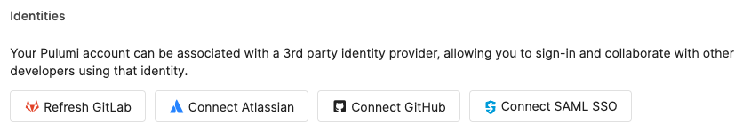
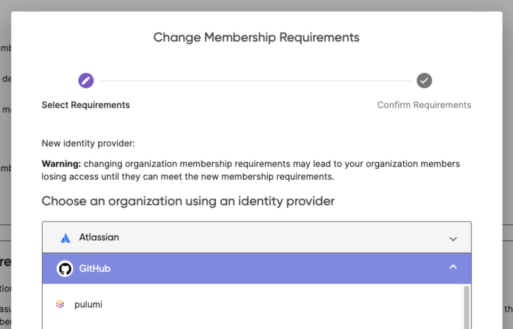

# Git Push to Deploy

> **_NOTE:_**  This feature is still being actively developed, expect daily improvements and modifications. In order to try it out as a beta user you will have to go through more steps then at launch.

You can use this feature on your Pulumi individual account or in a Pulumi organization.

## GitHub Setup

### GitHub Organization Name Requirement (Organization only)

In order to use this feature in a Pulumi organization your GitHub organization and Pulumi organization name need to match. Ensure they have the same name, for example the GitHub organization is named `burbsburgers` and the Pulumi organization is also named `burbsburgers`.

### GitHub Membership Requirement

Currently you will need the Pulumi account, and if connecting a stack in an organization, also the Pulumi organization, to be managed on GitHub. To do this follow these steps:

**Account**

1. Ensure your Pulumi account is selected in the top left drop-down
2. Navigate to Settings > General
3. Under Identities select Connect to GitHub
4. Go through the flow to connect to GitHub

**Organization**

1. Ensure the desired Pulumi organization is selected in the Organization drop-down
2. Navigate to Settings > Access Management
3. Select the Change requirements button
4. Select GitHub to expand the options
5. Select the GitHub organization that matches the Pulumi organization name

### GitHub App Installation

You'll need to install and configure the [Pulumi GitHub App](https://github.com/apps/pulumi). It requires read access to your repos so it can clone Pulumi programs and listen to merge commits to automatically trigger deployments on `git push`. Follow these steps:

**Organization **

1. Ensure the Pulumi organization that matches the GitHub organization is selected in the Organization drop-down
2. Navigate to Settings > Integrations
3. Select the Install the Pulumi GitHub App button
  

4. You will be directed to GitHub, select the GitHub organization that matches the Pulumi organization name
5. Select the repos (or all repos) and then Install 
6. Return to app.pulumi.com and ensure the GitHub App is installed

** Account **

1. Navigate to Settings > Integrations with your individual account selected from the dropdown
2. Select the Install the Pulumi GitHub App button
  

1. You will be directed to GitHub, select your GitHub username
2. Select the repos (or all repos) and then Install
3. Return to app.pulumi.com and ensure the GitHub App is installed

## Deployment Settings

### GitHub Configuration

We need your GitHub repo and branch in order to connect a stack to Pulumi Deployments. Follow these steps to get a Deployment running:

1. Navigate to a stack you want to connect to Pulumi Deployments.
2. Go to Settings > Deploy
3. Select the GitHub Repository with source context for Pulumi to Deploy
4. Select the branch
5. Ensure you have the required Environment Variables to run your repository

### Create a Deployment

You can now create a Deployment by using the Deploy Actions buttons or by pushing a commit to a GitHub pull request. If the Deploy Actions drop-down is not appearing on your stack page, try refreshing the page.

If you have any questions at all, please reach out in the #pulumi-deploy-beta Slack channel.
