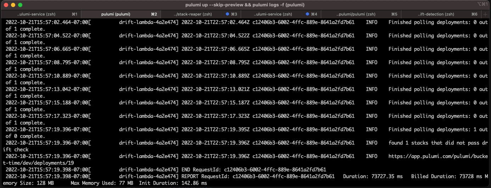

# Drift Detection

The drift detection stack is a piece of infrastructure that repeatedly runs refreshes on your infrastructure via the Pulumi Deployment API to detect when your desired infrastructure state has diverged from the reality in production.

Drift detection can alert you to situations where someone has made manual edits to infra via the AWS console, without syncing up those changes in the Pulumi program.



## Setup

1. Install prerequisites:

    ```bash
    npm install
    ```

1. Create a new Pulumi stack, which is an isolated deployment target for this example:

    ```bash
    pulumi stack init
    ```

1. Set required configuration

    Using the pulumi deployment API requires a [pulumi access token](https://www.pulumi.com/docs/intro/pulumi-service/accounts/#access-tokens). 

    ```bash
    pulumi config set aws:region us-west-2
    pulumi config set --secret pulumiAccessToken xxxxxxxxxxxxxxxxx # your access token value
    pulumi config set 'stack[0]' organization/project1/stack1
    pulumi config set 'stack[1]' organization/project2/stack2
    ```

1. Execute the Pulumi program:

    ```bash
    pulumi up
    ```

1. Follow logs to see drifted stacks

    ```bash
    pulumi logs -f
    ```

