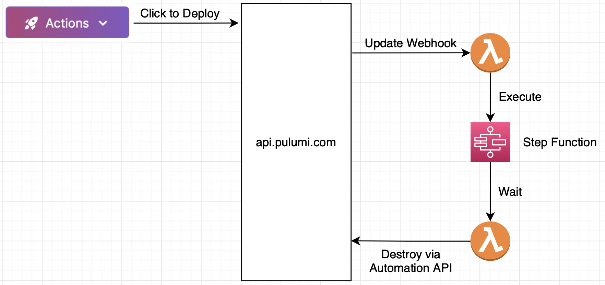

# TTL stacks

The TTL stack processor is a piece of infrastructure that allows you to set a
stack tag that triggers automatic destroy via the Pulumi Deployment API after
the expiration time passes. This enables temporary development infrastructure.

Infrastructure waste is a common problem. It’s too easy to leave development
infrastructure running accidentally and end up with a huge bill. Many companies
have entire teams devoted to solving this problem.

After deploying this program you can do the following on any program in your
pulumi organization:

```console
# on any stack in your organization
$ pulumi stack tag set ttl 30 # minutes to wait until destroying the stack
$ pulumi up
# 30 minutes later the stack will be cleaned up via the Pulumi Deployment API
```


## Setup

1. Install prerequisites:

    ```bash
    npm install
    ```

1. Create a new Pulumi stack, which is an isolated deployment target for this
   example:

    ```bash
    pulumi stack init
    ```

1. Set required configuration

    Using the pulumi deployment API requires a [pulumi access token](https://www.pulumi.com/docs/intro/pulumi-service/accounts/#access-tokens).

    ```bash
    pulumi config set aws:region us-west-2
    pulumi config set --secret pulumiAccessToken xxxxxxxxxxxxxxxxx # your access token value
    ```

1. Execute the Pulumi program:

    ```bash
    pulumi up
    ```

You should now be able to `pulumi stack tag set ttl X && pulumi up` (X=minutes)
to create stacks that destroy themselves after the specified expiry.


## Architecture

The TTL processor uses an event-driven architecture. The Pulumi Service sends
events to the TTL processor via a webhook. The webhook lambda queries the
Pulumi Service via REST API to determine the stack's tags, and when it observes
an update with a `ttl` tag it schedules the stack for cleanup. A step function
waits the appropriate amount of time and then runs a cleanup lambda, which runs
a `pulumi destroy` via the Automation API in the Pulumi Service.


